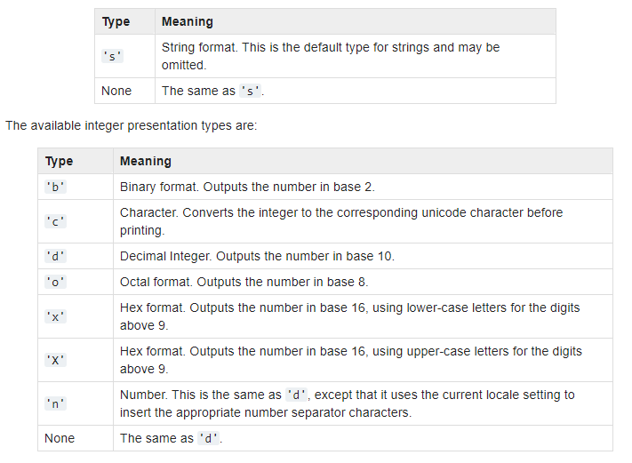

# Learning Python

This are the topics I will be studying.

## Section I

- [x] Python Programming Basics
- [x] Variable Names
- [x] Basic Operators
- [x] Core Data types
- [x] Numeric Types
- [x] Precedence and Associativity

## Section II

- [x] Exception Handling
- [x] Pseudocode, Algorithms and Examples
- [x] Sequence, Selection and Iteration
- [x] Python Functions (Functional Programming)
- [ ] Classes and Objects

## Section III

- [ ] Files Processing and Pickle Module
- [ ] Operator Overloading
- [ ] Regular Expressions
- [ ] Encapsulation
- [ ] Inheritance
- [ ] Data Abstraction
- [ ] Polymorphism

---

